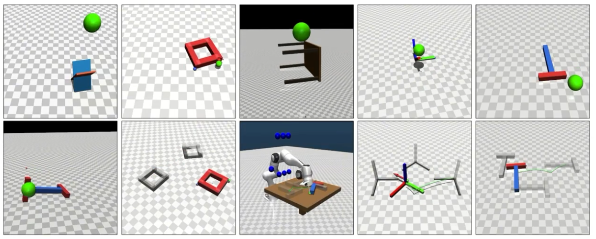

# unicomp
A Unified Complementarity-based Approach for Rigid-Body Manipulation and Motion Prediction

# Unicomp (compsim) — Setup & Quickstart

This repo contains:
- `compsim/` — complementarity-based pushing simulation code
- `model/` — MuJoCo models/assets
- `scripts/` — runnable demos (executed with `python -m scripts...`)

Recommended conda environment name: **`unicomp`**.

---

## 1) Create the conda environment

### 1.1 Create + activate
```bash
conda create -n unicomp python=3.10 -y
conda activate unicomp
```

### 1.2 Install build toolchain + core dependencies
These are required to build Siconos (numerics-only) and run the demos.

```bash
conda install -c conda-forge -y \
  cmake ninja compilers \
  numpy scipy \
  openblas lapack \
  boost-cpp eigen \
  gmp \
  packaging wheel \
  "swig<4.3"
```

> **Important:** `swig<4.3` is required (newer SWIG versions can break Siconos SWIG wrappers).

---

## 2) Install SuiteSparse (required by Siconos numerics)

```bash
conda activate unicomp
conda install -c conda-forge -y suitesparse libcxsparse
```

Quick check (optional):
```bash
ls $CONDA_PREFIX/lib | egrep "cxsparse|cholmod|umfpack|klu|spqr" || true
```

---

## 3) Build & install Siconos (numerics-only)

### 3.1 Clone Siconos
From your workspace directory (example: `~/unicomp`):

```bash
cd ~/unicomp
git clone --recursive https://github.com/siconos/siconos.git
cd siconos
```

### 3.2 Create the minimal Siconos config (numerics-only)
This avoids heavy dependencies like Bullet/VTK from `mechanics`.

```bash
cat > numerics_only.cmake <<'EOF'
# Build only externals + numerics
set(COMPONENTS externals numerics CACHE STRING "" FORCE)

# Enable Python wrapper
set(WITH_PYTHON_WRAPPER ON CACHE BOOL "" FORCE)

# Disable modules that pull heavy deps (Bullet/VTK/etc.)
set(WITH_MECHANICS OFF CACHE BOOL "" FORCE)
set(WITH_IO OFF CACHE BOOL "" FORCE)

# Disable testing to avoid extra python/cpp test deps
set(WITH_TESTING OFF CACHE BOOL "" FORCE)
EOF
```

### 3.3 Configure / build / install
After installing SuiteSparse, you **must** re-run CMake and then **build + install** Siconos numerics,
otherwise the compiled Python extension `_sicpynumerics*.so` will not be produced/installed.

```bash
rm -rf build-numerics

cmake -S . -B build-numerics \
  -DUSER_OPTIONS_FILE=$PWD/numerics_only.cmake \
  -DCMAKE_BUILD_TYPE=Release \
  -DPython_EXECUTABLE="$(which python)" \
  -DSWIG_EXECUTABLE="$(which swig)" \
  -DCMAKE_PREFIX_PATH="$CONDA_PREFIX"

cmake --build build-numerics -j"$(nproc)"
cmake --install build-numerics
```

### 3.4 Verify Siconos numerics works
You must see `_sicpynumerics*.so` and the import must succeed.

```bash
python -c "import siconos, os, glob; p=os.path.dirname(siconos.__file__); print('pkg=',p); print('so=',glob.glob(p+'/_sicpynumerics*.so'))"
python -c "import siconos.numerics as sn; print('siconos.numerics OK')"
```

---

## 4) Install runtime dependencies for visualization (MuJoCo)

If you want `--view` / realtime viewers:

```bash
conda install -c conda-forge -y mujoco glfw pyopengl
```

Optional (if you use JAX in the project; CPU is recommended):
```bash
conda install -c conda-forge -y "jax>=0.4" "jaxlib>=0.4"
```

---

## 5) Quick sanity check

```bash
python -V
which python
swig -version
python -c "import numpy; import packaging; print('python ok')"
python -c "import mujoco; print('mujoco ok')"
python -c "import siconos.numerics as sn; print('siconos numerics ok')"
```

---

## 6) Run demos

From the repo root (example `~/unicomp`), make sure the environment is active:

```bash
conda activate unicomp
cd ~/unicomp
```

### 6.1 Interactive single-block pushing (with tool)
```bash
python3 -m scripts.interact_block_pushing --view --use_tool --realtime
```

### 6.2 Interactive multi-block pushing
```bash
python3 -m scripts.interact_multi_blocks_pushing --view --realtime
```

### 6.3 Waypoints block pushing (multiple viewers)
```bash
python3 -m scripts.waypoints_block_pushing --view --view_realtime --live_view
```

---

## 7) Troubleshooting

### A) `ImportError: cannot import name '_sicpynumerics'`
This means `siconos/numerics.py` exists but `_sicpynumerics*.so` is missing.

Fix:
1) Ensure `swig -version` is `< 4.3`
2) Rebuild Siconos numerics-only:
   ```bash
   cd ~/unicomp/siconos
   rm -rf build-numerics
   cmake -S . -B build-numerics \
     -DUSER_OPTIONS_FILE=$PWD/numerics_only.cmake \
     -DCMAKE_BUILD_TYPE=Release \
     -DPython_EXECUTABLE="$(which python)" \
     -DSWIG_EXECUTABLE="$(which swig)" \
     -DCMAKE_PREFIX_PATH="$CONDA_PREFIX"
   cmake --build build-numerics -j"$(nproc)"
   cmake --install build-numerics
   ```

### B) CMake cannot find SuiteSparse / CXSparse
Install:
```bash
conda install -c conda-forge -y suitesparse libcxsparse
```

### C) Viewer doesn’t open / OpenGL errors
Make sure you installed:
```bash
conda install -c conda-forge -y mujoco glfw pyopengl
```

---

## Notes
- This README documents a minimal, reproducible setup for running the complementarity-based pushing demos.
- If you later enable additional Siconos modules (e.g., `mechanics`), extra dependencies (Bullet/VTK) will be required.


## Citation

If you find this code useful, you can cite our paper:

```bibtex
@misc{huang2026unifiedcomplementaritybasedapproachrigidbody,
      title={A Unified Complementarity-based Approach for Rigid-Body Manipulation and Motion Prediction}, 
      author={Bingkun Huang and Xin Ma and Nilanjan Chakraborty and Riddhiman Laha},
      year={2026},
      eprint={2602.04522},
      archivePrefix={arXiv},
      primaryClass={cs.RO},
      url={https://arxiv.org/abs/2602.04522}, 
}